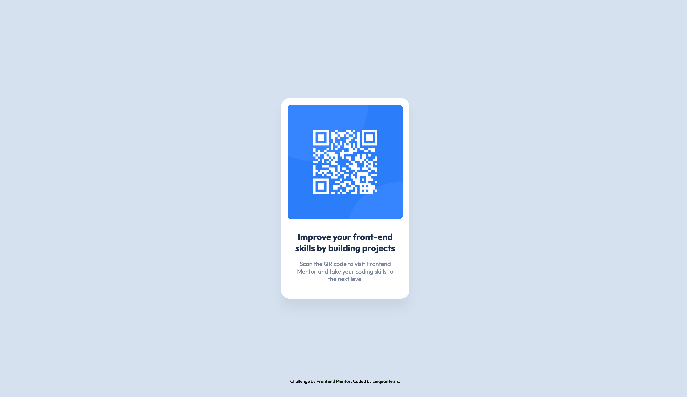

# Frontend Mentor - QR code component solution

This is a solution to the [QR code component challenge on Frontend Mentor](https://www.frontendmentor.io/challenges/qr-code-component-iux_sIO_H). Frontend Mentor challenges help you improve your coding skills by building realistic projects. 

## Table of contents

- [Overview](#overview)
  - [Screenshot](#screenshot)
  - [Links](#links)
- [My process](#my-process)
  - [Built with](#built-with)
  - [What I learned](#what-i-learned)
  - [Continued development](#continued-development)
  - [Useful resources](#useful-resources)
- [Author](#author)

## Overview

### Screenshot

### Links

- Solution URL: [QR code component](https://github.com/Cinquantesix/FM-2407-qr-code-component-main)
- Live Site URL: [QR code component](https://main--fm-2407-qr-code-component-main.netlify.app/)

## My process

### Built with

- Semantic HTML5 markup
- CSS custom properties
- Background radial gradient

### What I learned

I tried to use gradient background. Because in the Figma file, the backgroun change between desktop and mobile and I tried to make it. I'm pretty happy because gradient was always a little bit scary for me to use.

### Continued development

I will try to have a better html and css structure for the next project. I also want to add some comment to be clear wy I'm doing this way.

### Useful resources

- [Radial Gradiant](https://www.quirksmode.org/css/images/position.html) - Help me a lot.

## Author

- Website - [cinquantesix](https://cinquantesix.ch)
- Frontend Mentor - [@Cinquantesix](https://www.frontendmentor.io/profile/Cinquantesix)